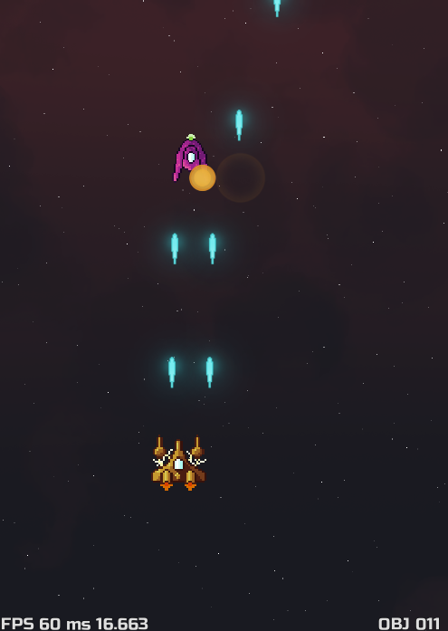

spaceship
===

My first serious game, built from the ground up.

This is a build setup for linux.

Intended to be written as a single source file (main.cpp),
with the most simple yet readable code that's needed to make a cool game.

Feel free to learn with the code, I am learning coding it too ;)

**Status:**



## Build

```
mkdir build
cd build
cmake .. -DCMAKE_BUILD_TYPE=Debug
cmake --build . --parallel $(nproc)
```

## Running

```
./build/spaceship/bin/spaceship
```

## Roadmap

- [X] Initial project structure & build system
- [X] Setup logging library and parse --log argument.
- [X] Create a Window with GLFW and Load OpenGL with glbinding
- [X] First colored Quad.
   * Color Shader
   * VBO, EBO, VAO, geometry,
   * Render procedure
- [X] Floating animation on the Quad
- [X] Load Texture into Quad
   * Texture Shader
   * Load texture with stb image
   * Render procedure
- [X] Sprite Animation
- [X] Handle Keyboard input
- [X] Render Text
   * Load TTF font
   * Generate Text Quads
   * Render procedure
   * FPS Counter
   * Generic Shader (color-texture-font)
- [X] Window Resizing & Camera
- [X] GameObject, Render Order & Layers
   * Scene GameObject Container
   * Texture Manager
   * Projectiles
- [X] Bounding Box & Collision Detection
   * AABB
   * Projectile Hits & Explosions
   * Bind player to Screen bounds
- [X] Audio with OpenAL
   * Load WAV audio
   * Associate with entities
- [X] Update Loop Improvements
   * Fixed Time Step
   * Linear Interpolation
   * Handle Key Events at fixed rate
- [ ] Game FSM & Scenes
   * Game Start screen
   * Game Over screen
   * Game State FSM
   * Enemy Logic
- [ ] Windows Platform
- [ ] Optimization
   * Instanced Rendering
   * OpenGL 4.5 DSA
   * Array Textures
   * Custom Allocators
   * Double Buffer
   * Multithreading
- [ ] Android Platform
